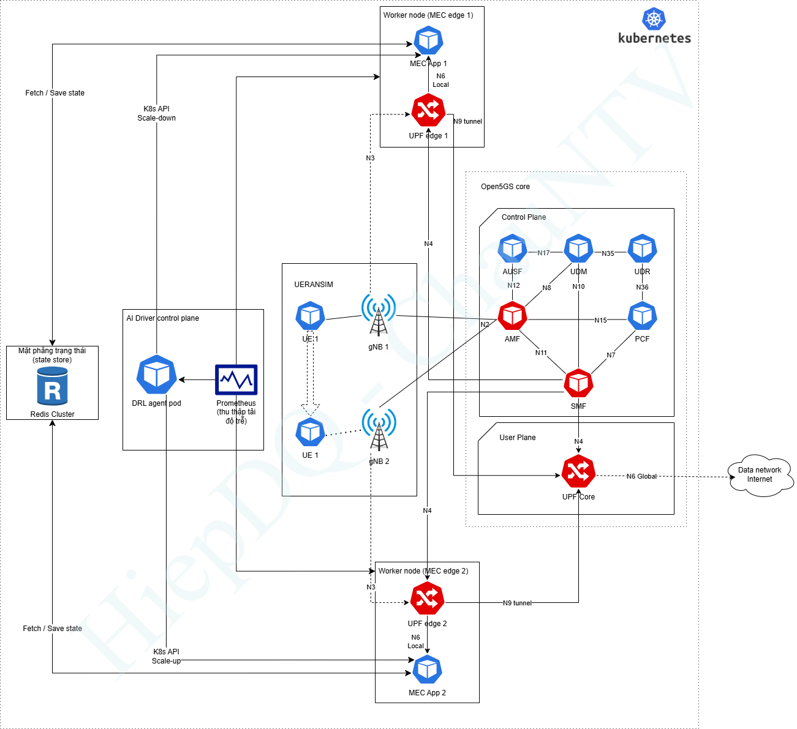

# Mô phỏng open5gs ở biên MEC với k8s

# Kiến trúc


# 1. Master node: Ubuntu 22.04 LTS; 4 cores, 4GB RAM, and internet access.
#Clone the repository
```bash
git clone https://github.com/niloysh/testbed-automator.git
cd testbed-automator
```
#Run the installation script
```bash
./install.sh
```


# 2. Worker Node: On each worker node, run the install.sh script with the --worker flag as follows.
#Clone the repository
```bash
git clone https://github.com/niloysh/testbed-automator.git
cd testbed-automator
```

#Run the installation script for the worker node
```bash
sudo ./install.sh --worker
```


# 3. On the master node, execute:
```bash
sudo ./worker-join-token.sh
```
#This will output a command that includes the token and IP address for the worker node to join the cluster.


# 4. Join the Worker Nodes: On each worker node, run (with sudo) the join command generated by worker-join-token.sh on the master node. The command will look something like this:
```bash
sudo kubeadm join <master-ip>:<port> --token <token> --discovery-token-ca-cert-hash <hash>
kubectl get nodes
```


#Connect every worker node to the master node using VXLAN tunnels:
```bash
sudo python3 setup-tunnels.py
```


# 5. Install Kustomize from the Go source code
#Install the kustomize CLI from source without cloning the repo
#For go version ≥ go1.17
```bash
GOBIN=$(pwd)/ GO111MODULE=on go install sigs.k8s.io/kustomize/kustomize/v5@latest
```


#For go version < go1.17
```bash
GOBIN=$(pwd)/ GO111MODULE=on go get sigs.k8s.io/kustomize/kustomize/v5
```


# 6. Deploy MongoDB with Kustomize
```bash
kubectl apply -k mongodb -n open5gs
kubectl get pods -n open5gs
kubectl logs mongodb-0 -n open5gs
```


# 7. Deploy the Network Attachment Definitions (NAD) for Multus
```bash
sudo ovs-vsctl show
kubectl apply -k networks5g -n open5gs
kubectl get network-attachment-definition -n open5gs
```


# 8. Deploying Open5gs
```bash
kubectl apply -k open5gs -n open5gs
```


# 9. Tạo file định nghĩa mạng N6 Local
```bash
cat <<EOF > n6-local-net.yaml
apiVersion: "k8s.cni.cncf.io/v1"
kind: NetworkAttachmentDefinition
metadata:
  name: n6-local
  namespace: open5gs
spec:
  config: '{
    "cniVersion": "0.3.1",
    "type": "macvlan",
    "master": "ens19",
    "mode": "bridge",
    "ipam": {
      "type": "host-local",
      "subnet": "10.10.6.0/24",
      "rangeStart": "10.10.6.10",
      "rangeEnd": "10.10.6.99",
      "routes": [
        { "dst": "0.0.0.0/0" }
      ],
      "gateway": "10.10.6.1"
    }
  }'
EOF
```


# 10. Tạo file định nghĩa mạng N6 Global
```bash
cat <<EOF > n6-global-net.yaml
apiVersion: "k8s.cni.cncf.io/v1"
kind: NetworkAttachmentDefinition
metadata:
  name: n6-global
  namespace: open5gs
spec:
  config: '{
    "cniVersion": "0.3.1",
    "type": "macvlan",
    "master": "ens19",
    "mode": "bridge",
    "ipam": {
      "type": "host-local",
      "subnet": "10.10.7.0/24",
      "rangeStart": "10.10.7.10",
      "rangeEnd": "10.10.7.99",
      "gateway": "10.10.7.1"
    }
  }'
```

# 11. upf1 chạy trên node open5gs
#CẤU HÌNH UPF BIÊN 1
```bash
apiVersion: v1
kind: ConfigMap
metadata:
  name: upf1-configmap
  namespace: open5gs
data:
  upfcfg.yaml: |
    logger: { file: /open5gs/install/var/log/open5gs/upf.log, level: info }
    global: { max: { ue: 1024 } }
    upf:
      pfcp: { server: [ { dev: n4 } ] }
      gtpu: { server: [ { dev: n3 }, { dev: n9 } ] }
      session: [ { subnet: 10.41.0.1/16, dnn: internet } ]
      metrics: { server: [ { address: 0.0.0.0, port: 9090 } ] }
  wrapper.sh: |
    #!/bin/bash
    ip tuntap add name ogstun mode tun
    ip addr add 10.41.0.1/16 dev ogstun
    sysctl -w net.ipv6.conf.all.disable_ipv6=1
    ip link set ogstun up
    sh -c "echo 1 > /proc/sys/net/ipv4/ip_forward"
    iptables -t nat -A POSTROUTING -s 10.41.0.0/16 ! -o ogstun -j MASQUERADE
    /open5gs/install/bin/open5gs-upfd -c /open5gs/config/upfcfg.yaml
---
apiVersion: apps/v1
kind: Deployment
metadata:
  name: open5gs-upf1
  namespace: open5gs
spec:
  replicas: 1
  selector: { matchLabels: { app: open5gs, name: upf1 } }
  template:
    metadata:
      labels: { app: open5gs, name: upf1 }
      annotations:
        k8s.v1.cni.cncf.io/networks: '[ 
          { "name": "n4network", "interface": "n4", "ips": [ "10.10.4.1/24" ] }, 
          { "name": "n3network", "interface": "n3" }, 
          { "name": "n9-tunnel", "interface": "n9", "ips": [ "10.10.9.11/24" ] },
          { "name": "n6-local", "interface": "n6", "ips": [ "10.10.6.11/24" ] } 
        ]'
    spec:
      nodeSelector:
        kubernetes.io/hostname: open5gs
      containers:
      - name: upf
        image: ghcr.io/niloysh/open5gs:v2.7.0-v2
        command: ["/open5gs/config/wrapper.sh"]
        securityContext: { privileged: true }
        volumeMounts: [ { mountPath: /open5gs/config/, name: upf-vol } ]
      volumes:
      - name: upf-vol
        configMap: { name: upf1-configmap, defaultMode: 0777 }
```

# 12. upf2 chạy trên workerk8s
#CẤU HÌNH UPF BIÊN 2 (Tương tự UPF1 nhưng đổi IP và Node)
```bash
apiVersion: v1
kind: ConfigMap
metadata:
  name: upf2-configmap
  namespace: open5gs
data:
  upfcfg.yaml: |
    logger: { file: /open5gs/install/var/log/open5gs/upf.log, level: info }
    global: { max: { ue: 1024 } }
    upf:
      pfcp: { server: [ { dev: n4 } ] }
      gtpu: { server: [ { dev: n3 }, { dev: n9 } ] }
      session: [ { subnet: 10.41.0.1/16, dnn: internet } ]
      metrics: { server: [ { address: 0.0.0.0, port: 9090 } ] }
  wrapper.sh: |
    #!/bin/bash
    ip tuntap add name ogstun mode tun; ip addr add 10.41.0.1/16 dev ogstun; ip link set ogstun up
    sh -c "echo 1 > /proc/sys/net/ipv4/ip_forward"
    iptables -t nat -A POSTROUTING -s 10.41.0.0/16 ! -o ogstun -j MASQUERADE
    /open5gs/install/bin/open5gs-upfd -c /open5gs/config/upfcfg.yaml
---
apiVersion: apps/v1
kind: Deployment
metadata:
  name: open5gs-upf2
  namespace: open5gs
spec:
  replicas: 1
  selector: { matchLabels: { app: open5gs, name: upf2 } }
  template:
    metadata:
      labels: { app: open5gs, name: upf2 }
      annotations:
        k8s.v1.cni.cncf.io/networks: '[ 
          { "name": "n4network", "interface": "n4", "ips": [ "10.10.4.2/24" ] }, 
          { "name": "n3network", "interface": "n3" }, 
          { "name": "n9-tunnel", "interface": "n9", "ips": [ "10.10.9.12/24" ] },
          { "name": "n6-local", "interface": "n6", "ips": [ "10.10.6.12/24" ] } 
        ]'
    spec:
      nodeSelector:
        kubernetes.io/hostname: workerk8s
      containers:
      - name: upf
        image: ghcr.io/niloysh/open5gs:v2.7.0-v2
        command: ["/open5gs/config/wrapper.sh"]
        securityContext: { privileged: true }
        volumeMounts: [ { mountPath: /open5gs/config/, name: upf-vol } ]
      volumes:
      - name: upf-vol
        configMap: { name: upf2-configmap, defaultMode: 0777 }
```


# 13. gNB 1 (Chạy trên Node Biên 1)
```bash
apiVersion: apps/v1
kind: Deployment
metadata:
  name: ueransim-gnb-mec1
  namespace: open5gs
spec:
  replicas: 1
  selector: { matchLabels: { app: ueransim, name: gnb-mec1 } }
  template:
    metadata:
      labels: { app: ueransim, name: gnb-mec1 }
      annotations: { k8s.v1.cni.cncf.io/networks: '[ { "name": "n3network", "interface": "n3" } ]' }
    spec:
      nodeSelector:
        kubernetes.io/hostname: open5gs
      containers:
      - name: gnb
        image: free5gmano/ueransim:v3.2.6
        command: ["./nr-gnb", "-c", "/config/gnb.yaml"]
        volumeMounts: [ { name: gnb-config, mountPath: /config } ]
        securityContext: { privileged: true }
      volumes:
      - name: gnb-config
        configMap: { name: gnb-mec1-config }
```

# 14. gNB 2 (Chạy trên Node Biên 2)
```bash
apiVersion: apps/v1
kind: Deployment
metadata:
  name: ueransim-gnb-mec2
  namespace: open5gs
spec:
  replicas: 1
  selector: { matchLabels: { app: ueransim, name: gnb-mec2 } }
  template:
    metadata:
      labels: { app: ueransim, name: gnb-mec2 }
      annotations: { k8s.v1.cni.cncf.io/networks: '[ { "name": "n3network", "interface": "n3" } ]' }
    spec:
      nodeSelector:
        kubernetes.io/hostname: workerk8s
      containers:
      - name: gnb
        image: free5gmano/ueransim:v3.2.6
        command: ["./nr-gnb", "-c", "/config/gnb.yaml"]
        volumeMounts: [ { name: gnb-config, mountPath: /config } ]
        securityContext: { privileged: true }
      volumes:
      - name: gnb-config
        configMap: { name: gnb-mec2-config }
```


# 15. UE1 (Chạy trên Node UE)
```bash
apiVersion: apps/v1
kind: Deployment
metadata:
  name: ueransim-ue1
  namespace: open5gs
spec:
  replicas: 1
  selector: { matchLabels: { app: ueransim, name: ue1 } }
  template:
    metadata:
      labels: { app: ueransim, name: ue1 }
    spec:
      nodeSelector:
        kubernetes.io/hostname: ue
      containers:
      - name: ue
        image: free5gmano/ueransim:v3.2.6
        command: ["sh", "-c", "sleep 10 && ./nr-ue -c /config/ue.yaml"]
        securityContext: { privileged: true, capabilities: { add: ["NET_ADMIN"] } }
        volumeMounts: [ { name: ue-config, mountPath: /config } ]
      volumes:
      - name: ue-config
        configMap: { name: ue1-config }
```

# 16. Tạo mạng N9 Tunnel (Đường hầm nối UPF Edge và UPF Core)
```bash
cat <<EOF > n9-tunnel-net.yaml
apiVersion: "k8s.cni.cncf.io/v1"
kind: NetworkAttachmentDefinition
metadata:
  name: n9-tunnel
  namespace: open5gs
spec:
  config: '{
    "cniVersion": "0.3.1",
    "type": "macvlan",
    "master": "ens19",
    "mode": "bridge",
    "ipam": {
      "type": "host-local",
      "subnet": "10.10.9.0/24",
      "rangeStart": "10.10.9.10",
      "rangeEnd": "10.10.9.99",
      "routes": [
        { "dst": "10.10.9.0/24" }
      ],
      "gateway": "10.10.9.1"
    }
  }'
EOF
```


# 17. Tạo ConfigMap cho UPF-Core
```bash
apiVersion: v1	
kind: ConfigMap	
metadata:	
  name: upf-core-configmap	
  namespace: open5gs	
  labels:	
    app: open5gs	
    name: upf-core	
    nf: upf	
data:	
  upfcfg.yaml: |	
    logger:	
        file: /open5gs/install/var/log/open5gs/upf.log	
        level: info	
    global:	
      max:	
        ue: 1024	
    upf:	
      pfcp:	
        server:	
          - dev: n4	
      gtpu:	
        server:	
          - dev: n9	
      session:	
        - subnet: 10.41.0.1/16	
          dnn: internet	
      metrics:	
        server:	
          - address: 0.0.0.0	
            port: 9090	
  wrapper.sh: |	
    #!/bin/bash   	
    ip tuntap add name ogstun mode tun;	
    ip addr add 10.41.0.1/16 dev ogstun;	
    sysctl -w net.ipv6.conf.all.disable_ipv6=1;	
    ip link set ogstun up;	
    sh -c "echo 1 > /proc/sys/net/ipv4/ip_forward";	
    iptables -t nat -A POSTROUTING -s 10.41.0.0/16 ! -o ogstun -j MASQUERADE;	
    /open5gs/install/bin/open5gs-upfd -c /open5gs/config/upfcfg.yaml	
```


# 18. Cấu hình Deployment UPF-core
```bash
nano upf-core.yaml	

apiVersion: apps/v1	
kind: Deployment	
metadata:	
  name: open5gs-upf-core	
  namespace: open5gs	
spec:	
  replicas: 1	
  selector:	
    matchLabels:	
      app: open5gs	
      name: upf-core	
      nf: upf	
  template:	
    metadata:	
      labels:	
        app: open5gs	
        name: upf-core	
        nf: upf	
      annotations:	
        k8s.v1.cni.cncf.io/networks: '[ { "name": "n4network", "interface": "n4", "ips": [ "10.10.4.3/24" ] }, { "name": "n6-global", "interface": "n6", "ips": [ "10.10.7.13/24" ] }, { "name": "n9-tunnel", "interface": "n9", "ips": [ "10.10.9.13/24" ] } ]'	
    spec:	
      nodeSelector:	
        site: cloud	
      initContainers:	
      - command: ["sh", "-c", "until nc -z $DEPENDENCIES; do echo waiting for the SMF; sleep 2; done;"]	
        env:	
        - name: DEPENDENCIES	
          value: smf1-nsmf:80	
        image: busybox:1.32.0	
        name: wait-smf	
      containers:	
      - command: ["/open5gs/config/wrapper.sh"]	
        image: ghcr.io/niloysh/open5gs:v2.7.0-v2	
        name: upf	
        securityContext:	
          privileged: true	
        volumeMounts:	
        - mountPath: /open5gs/config/	
          name: upf-volume	
      volumes:	
      - configMap:	
          items:	
          - key: upfcfg.yaml	
            path: upfcfg.yaml	
          - key: wrapper.sh	
            mode: 511	
            path: wrapper.sh	
          name: upf-core-configmap	
        name: upf-volume
```


# 19. Tạo file configmap smf
```bash
cat <<EOF | kubectl apply -f -
apiVersion: v1
kind: ConfigMap
metadata:
  name: smf1-configmap
  namespace: open5gs
  labels:
    app: open5gs
    name: smf1
    nf: smf
data:
  smfcfg.yaml: |
    logger:
      file: /open5gs/install/var/log/open5gs/smf.log

    global:
      max:
        ue: 1024

    smf:
      sbi:
        server:
          - dev: eth0
            advertise: smf1-nsmf
            port: 80
        client:
          scp:
            - uri: http://scp-nscp:80
          
      pfcp:
        server:
          - dev: n4
        client:
          upf:
            - address: 10.10.4.3
              dnn: internet
            - address: 10.10.4.1
              dnn: internet
            - address: 10.10.4.2
              dnn: internet
              
      gtpc:
        server:
          - dev: eth0
      gtpu:
        server:
          - dev: n3
      metrics:
        server:
          - address: 0.0.0.0
            port: 9090
      session:
        - subnet: 10.41.0.1/16
      dns:
        - 8.8.8.8
        - 8.8.4.4
      mtu: 1400
      ctf:
        enabled: auto
      freeDiameter: /open5gs/install/etc/freeDiameter/smf.conf

      info:
        - s_nssai:
          - sst: 1
            sd: 000001
            dnn:
             - internet

      upf:
        - address: 10.10.4.3
        - address: 10.10.4.1
          links:
            - address: 10.10.4.3
        - address: 10.10.4.2
          links:
            - address: 10.10.4.3

      route:
        - destination: 10.10.6.0/24
          upf:
            - address: 10.10.4.1
        - destination: 10.10.6.0/24
          upf:
            - address: 10.10.4.2
EOF
```

# 20. Cụm Redis (Stateful Context Management)
#File: redis-cluster.yaml
```bash
apiVersion: v1
kind: Service
metadata:
  name: redis-mec
  namespace: open5gs
spec:
  ports:
  - port: 6379
  selector:
    app: redis
---
apiVersion: apps/v1
kind: Deployment
metadata:
  name: redis-mec
  namespace: open5gs
spec:
  replicas: 1
  selector: { matchLabels: { app: redis } }
  template:
    metadata: { labels: { app: redis } }
    spec:
      containers:
      - name: redis
        image: redis:alpine
        ports: [ { containerPort: 6379 } ]
        command: ["redis-server"]
```

# 21. Lớp Giám Sát (Prometheus Monitor)
#File: prometheus.yaml
```bash
apiVersion: v1
kind: ConfigMap
metadata:
  name: prometheus-config
  namespace: open5gs
data:
  prometheus.yml: |
    global:
      scrape_interval: 2s 
    scrape_configs:
      - job_name: 'open5gs-metrics'
        kubernetes_sd_configs:
          - role: pod
            namespaces:
              names: [ 'open5gs' ]
        relabel_configs:
          - source_labels: [__meta_kubernetes_pod_label_app]
            action: keep
            regex: open5gs
          - source_labels: [__meta_kubernetes_pod_container_port_number]
            action: keep
            regex: 9090
---
apiVersion: apps/v1
kind: Deployment
metadata:
  name: prometheus
  namespace: open5gs
spec:
  replicas: 1
  selector: { matchLabels: { app: prometheus } }
  template:
    metadata: { labels: { app: prometheus } }
    spec:
      containers:
      - name: prometheus
        image: prom/prometheus:latest
        args: [ "--config.file=/etc/prometheus/prometheus.yml" ]
        ports: [ { containerPort: 9090 } ]
        volumeMounts: [ { name: config-volume, mountPath: /etc/prometheus/ } ]
      volumes:
      - name: config-volume
        configMap: { name: prometheus-config }
---
apiVersion: v1
kind: Service
metadata:
  name: prometheus-svc
  namespace: open5gs
spec:
  type: ClusterIP
  ports: [ { port: 9090, targetPort: 9090 } ]
  selector: { app: prometheus }
```

# 22. DRL AI Agent
#File: drl-agent.yaml
```bash
apiVersion: v1
kind: ConfigMap
metadata:
  name: drl-agent-code
  namespace: open5gs
data:
  agent.py: |
    import time
    import requests
    import random
    
    PROMETHEUS_URL = "http://prometheus-svc:9090/api/v1/query"
    SMF_API_URL = "http://smf1-nsmf:80/nudm-sdm/v2/" # Cổng SBI của Open5GS

    def get_metrics():
        print("[Prometheus] Đang cào dữ liệu trạng thái mạng...")
        try:
            # Truy vấn Prometheus (Ví dụ: Số lượng PDU Session trên UPF1)
            response = requests.get(f"{PROMETHEUS_URL}?query=upf_sessions_total").json()
            return response['data']['result']
        except:
            return None

    def calculate_reward(state):
        # DDPG / PPO Logic xử lý ở đây
        print("[DRL Agent] Chạy thuật toán DQN... Tính toán Reward...")
        cpu_load_edge1 = random.randint(20, 90) # Giả lập metric
        return cpu_load_edge1

    def take_action(cpu_load):
        if cpu_load > 80:
            print(f"[Cảnh báo] Tải Edge 1 ({cpu_load}%) quá cao! Quyết định: Offload về Core.")
            # Thực thi API can thiệp Open5GS (PDU Session Update)
            action_payload = { "routing_rule": "10.10.4.3" } # Đẩy về Core UPF
            print(f"[SMF SBI] Đã gửi lệnh cập nhật định tuyến: {action_payload}")
        else:
            print(f"[Tối ưu] Tải Edge 1 ({cpu_load}%) ổn định. Quyết định: Local Breakout (MEC).")

    if __name__ == "__main__":
        print("🚀 Khởi động DRL AI Agent cho mạng 5G MEC SON...")
        while True:
            state = get_metrics()
            reward_metric = calculate_reward(state)
            take_action(reward_metric)
            print("-" * 50)
            time.sleep(5) # Vòng lặp học và điều phối mỗi 5 giây
---
apiVersion: apps/v1
kind: Deployment
metadata:
  name: drl-ai-agent
  namespace: open5gs
spec:
  replicas: 1
  selector: { matchLabels: { app: drl-agent } }
  template:
    metadata: { labels: { app: drl-agent } }
    spec:
      containers:
      - name: ai-agent
        image: python:3.9-slim
        command: ["/bin/sh", "-c", "pip install requests && python /app/agent.py"]
        volumeMounts: [ { name: code-volume, mountPath: /app } ]
      volumes:
      - name: code-volume
        configMap: { name: drl-agent-code }
```